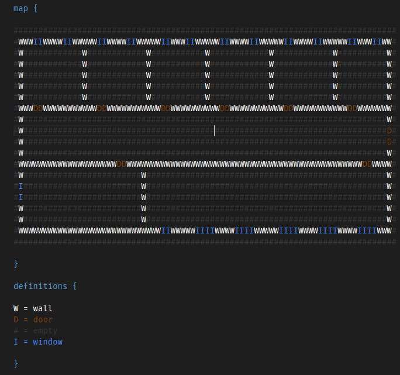

# game-worldmap-generator

This module can generate a list of GameObject's with the correct coordinates based on a string world map.

The file format for the world map looks like the following:

There are two main sections `map {}` and `definition {}`:

The `map {}` section describes the actual world map.
The `definition {}` section gives names to the different types of characters, which will be used as the GameObjec's name in the generated code.